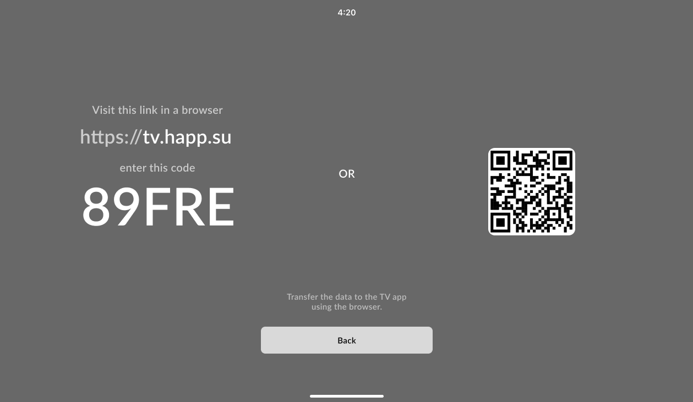

# Android TV



<figure><figcaption></figcaption></figure>



<figure><figcaption></figcaption></figure>



Happ 应用在 Android TV 上与移动端应用相同，可通过 APK 安装或通过 Google Play 下载。

首次启动时，应用会通过本地网络提供通过二维码添加订阅的选项。只需使用 iOS 或 Android 版 Happ 手机应用扫描二维码，手机就会尝试将选定的服务器或订阅传输到电视。如果本地网络传输失败，应用会建议通过互联网发送订阅。

此外，还可以通过网站 [tv.happ.su](https://tv.happ.su/) 或 [API](../dev-docs/android-tv-api.md) 远程将订阅或服务器配置传输到电视。在电视上选择 **Web Import**，输入屏幕上显示的代码，或者扫描二维码并在手机浏览器中打开链接。
