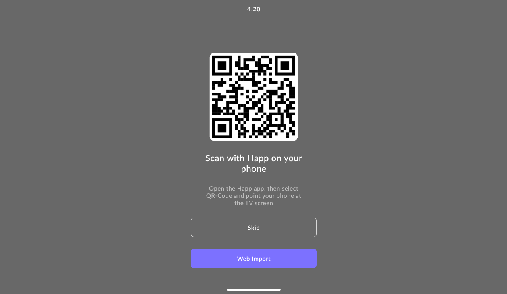

# Android TV



<figure><figcaption></figcaption></figure>



<figure><figcaption></figcaption></figure>



Приложение Happ на Android TV не отличается от мобильного приложения и устанавливается с помощью APK или через Google Play.

При первом запуске приложение предложит добавить подписку по локальной сети через QR-код. Просто отсканируйте QR-код в мобильном приложении Happ для iOS или Android, после чего телефон попытается передать выбранные серверы или подписку на телевизор. Если сделать это по локальной сети не удастся, приложение предложит отправить подписку через интернет.

Кроме того, возможно удаленно передать подписку или конфигурацию серверов на TV можно через сайт [tv.happ.su](https://tv.happ.su/) или [API](../dev-docs/android-tv-api.md). На телевизоре выберите пункт Web Import и введите отображённый код либо отсканируйте QR-код и откройте ссылку в браузере телефона.
